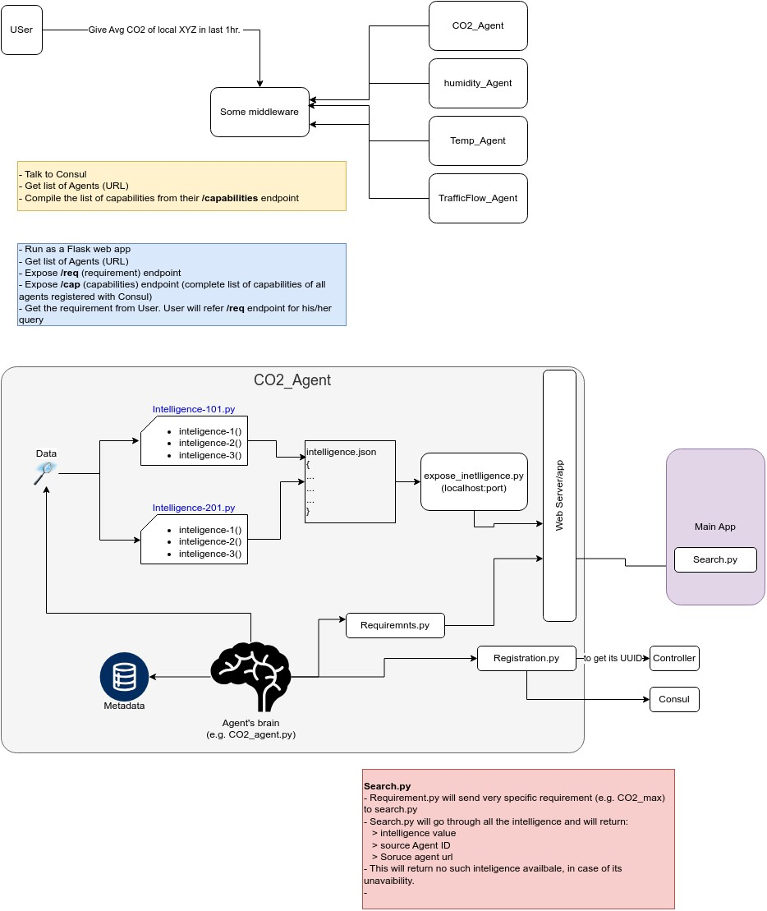

# CEI_platform
Platform for Clustered Edge Intelligence with discoverability and obserability capabilities.

## Overall Sy.


### Registration process


Intelligent Agent System with Web Dashboard:-

*OVERALL SYSTEM:-
This system is a distributed microservice-based infrastructure built for smart city applications. It integrates several AI-powered sensor agents that monitor environmental and traffic conditions. These agents are registered with a Consul service mesh for health tracking and service discovery. A central Flask-based web application serves as the control and monitoring interface

**SYSTEM ARCHITECTURE:-


CEI Platform is a microservice-based system designed to collect, process, and expose real-time traffic and environmental data. Individual agents either simulate or collect sensor data and register themselves with Consul for service discovery. Upon registration, each agent receives a unique UUID from the Controller and shares its metadata for identification and tracking. The collected data is stored locally within each agent and processed into meaningful intelligence. The Main Application aggregates this intelligence, provides search functionality, and exposes RESTful APIs for data access. A web-based user interface presents real-time insights and health status of all active agents in a centralized dashboard.

Agent is a self-contained microservice responsible for collecting, processing, and sharing sensor-based intelligence. Each agent maintains recent raw data in local memory, typically retaining it for a few days. It continuously analyzes this data to generate intelligence summaries such as averages, minimums, and maximums. These insights are exposed through RESTful endpoints (e.g., /intelligence), which are accessed by the Web Server to populate the central dashboard with real-time information.

   Web Application
1) Introduction:-
   The web application acts as the main centre for control and monitoring interface for all agents, providing a centralized system for managing distributed components. It leverages Consul for automatic service discovery and management of real-time health tracking of each agent. The system offers a range of RESTful API endpoints such as '/intelligence' , '/health' , '/search' , and '/data/export/json' , enabling access to sensor data and system intelligence. It also supports exporting this data in both JSON and CSV formats for offline analysis and reporting. This architecture is designed to be highly scalable, allowing new agents to automatically register themselves and become visible on the dashboard and become visible on dashboard without requiring manual configuration. 

3) Dashboard for all active agents:-

    - Access to intelligence data (e.g., CO2, humidity, noise) at localhost:8000/intelligence
    - Shows a table of all active agents with their health status whether reachable or not

## Features
- Auto-discovery of agents via Consul
- Data aggregation and analysis endpoints
- JSON/CSV export of intelligence logs
- Health status of all agents available if active shows reachable and if not unreachable 
- Shows agents port addresses and locations

# Installation & Configuration

 Environment
- OS: Windows
- Docker & Docker Compose
- Python 3.10+

## IDEs

- Visual Studio Code

##  PRE-REQUISITES (For Windows)

### 1.  Install Docker Desktop
- Download from: [https://www.docker.com/products/docker-desktop/](https://www.docker.com/products/docker-desktop/)
- Run the installer.
- Enable **WSL 2 support** if prompted (optional, not required for this project).
- Make sure Docker is running — check for the Docker whale icon in the system tray.

### 2.  Install Python 3 and pip
- Download Python from: [https://www.python.org/downloads/](https://www.python.org/downloads/)
- Run the Installer and double-click the downloaded `.exe` file to start the Python installation process.
- During installation, make sure to **check "Add Python to PATH"**
- After installation, open **CMD or PowerShell** and run:
  ```bash
  python --version
  pip --version

## LIBRARIES:-
### 1. `flask`
- **Purpose**: Flask is a lightweight web framework used to build RESTful APIs for each agent. It handles routing for endpoints like `/data`, `/intelligence`, `/health`, and others.
- **Usage in CEI Platform**: Every agent runs a Flask app to expose its sensor data and processed intelligence to the controller and web interface.
- **Installation**:
  ```bash
  pip install flask
  
  
### 2. `requests`
- **Purpose**: `requests` is a simple HTTP library for sending and receiving HTTP requests in Python.

- **Usage in CEI Platform**:
  - Register with the controller or Consul
  - Send metadata and health status
  - Fetch configuration or control messages

- **Installation**:
  ```bash
  pip install requests
  
### 3. `python-dateutil`
- **Purpose**:  
  This library simplifies date and time manipulation beyond what's available in Python’s built-in `datetime` module.

- **Usage in CEI Platform**:
  - Parsing timestamps from logs
  - Calculating time differences (e.g., when data was last updated)
  - Managing time windows for intelligence summaries (like last 5 minutes)

- **Installation**:
  ```bash
  pip install python-dateutil


## EXECUTION STEPS:-
```sh 
git clone https://github.com/chinmaya-dehury/CEI_platform.git
cd "CEI_platform"
docker-compose up --build(to build the containers)
docker-compose up(if already built)
```
## How to Use
1. It starts Consul and all agent containers to view agents on consul ui http://localhost:8500
2. Start the Central_app(web app) (`app.py`) at  http://localhost:8000
3. To stop all the running containers
    ```bash
    docker-compose down
4. To stop any one of agents container, the below one is for traffic_agent and can be exceuted similarly for others
   ```bash
    docker-compose down traffic_agent

For example to discover the health status via an endpoint
```
     http://localhost:5000/health  (traffic_agent)
     http://localhost:5001/health  (co2_agent)
     http://localhost:5002/health  (noise_agent)
     http://localhost:5003/health  (humidity_agent)
     http://localhost:5004/health  (temperature_agent)
     http://localhost:5006/search?requirement=co2_agent  (search_app - an example search for one of the agents)
```     
     
Explore endpoints like:

| Endpoint                    | Method | Description                                                                            | Output Format |
| --------------------------- | ------ | -------------------------------------------------------------------------------------- | ------------- |
| `/data`                     | GET    | Displays the latest **raw sensor data** from the agent.                                 | JSON          |
| `/description`              | GET    | Displays **agent metadata**, including name, UUID, unit, frequency, and location.       | JSON          |
| `/intelligence`             | GET    | Displays **analyzed data** (average, min, max) over recent timeframe (e.g., 5 minutes). | JSON          |
| `/download-uuid`            | GET    | Provides the agent’s **unique UUID** (identifier).                                     | JSON / Plain  |
| `/health`                   | GET    | Shows agent's **health status** (`Healthy`, `Unreachable`, etc.).                      | JSON          |
| `/data/export/json`         | GET    | Exports the **full raw data log** in **JSON** format.                                  | JSON file     |
| `/data/export/csv`          | GET    | Exports the **full raw data log** in **CSV** format.                                   | CSV file      |
| `/intelligence/export/json` | GET    | Exports **intelligence records** (aggregated data) in **JSON** format.                 | JSON file     |


## Testing & Access
- Consul UI: http://localhost:8500 (for service discoverability)
- WebApp UI: http://localhost:8000  (for dashboard central_app) and http://localhost:8000/intelligence (central_app intelligence list)


## Agents Overview

| Agent Name        | Intelligence Type   | Endpoint Example          | Info                     |
|-------------------|---------------------|----------------------------|--------------------------|
| `traffic_agent`   | Traffic congestion  | `/data`, `/intelligence`  | Vehicle counts in %      |
| `co2_agent`       | CO₂ emissions        | `/data`, `/intelligence`  | CO₂ levels in ppm        |
| `humidityagent`   | Humidity sensing    | `/data`, `/intelligence`  | Humidity %               |
| `temperatureagent`| Temperature         | `/data`, `/intelligence`  | Temperature in °C        |
| `noiseagent`      | Noise pollution     | `/data`, `/intelligence`  | Noise in dB              |

## Agent Registration (Consul + System)

 Auto-Registration Sample
```py
    def register_with_consul(): 
    service = {
        "ID": metadata["uuid"],
        "Name": AGENT_NAME,
        "Address": AGENT_NAME,
        "Port": PORT,
        "Meta": {"type": "sensor", "location": "sector-5"},
        "Check": {
            "HTTP": f"http://{AGENT_NAME}:{PORT}/health",
            "Interval": "10s"
        }
    }
    requests.put(f"http://consul:8500/v1/agent/service/register", json=service)
```

### component access:-

- Consul UI: http://localhost:8500
- WebApp: http://localhost:8000
- searchpy: http://localhost:5006/search?requirement=traffic_agent(this is for traffic_agent and similarly for others 

Agents: Registered and accessed via Docker hostnames (e.g., http://localhost:5000/health)


